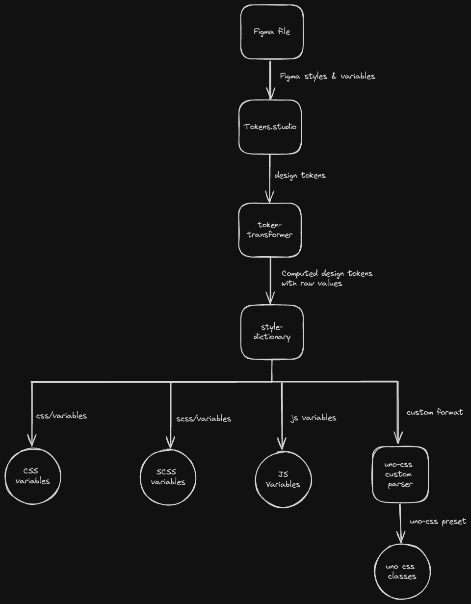

# POC - Design tokens to CSS primitives
This repository is created as a proof of concept for conversion of design tokens from figma and applying transformations
to them to produce web primitives in various web formats.

## Formats:

- CSS variables
- SCSS variables
- JS variables
- [UnoCSS](https://unocss.dev/) preset (only CSS supported for now)

## Generate the artifacts:

1. `npm run install`
2. `npm run token-transform`: Resolves the math operators as well as references in the design token file 
3. `npm run style-transform`: Use [style-dictionary](https://amzn.github.io/style-dictionary/) to produce the final style artifacts
4. `npm run build`

Note: To use the preset for UnoCSS, import the preset from `@design-token-to-web-primitives/unocss` and use it in your [UnoCSS config](https://unocss.dev/guide/presets).
